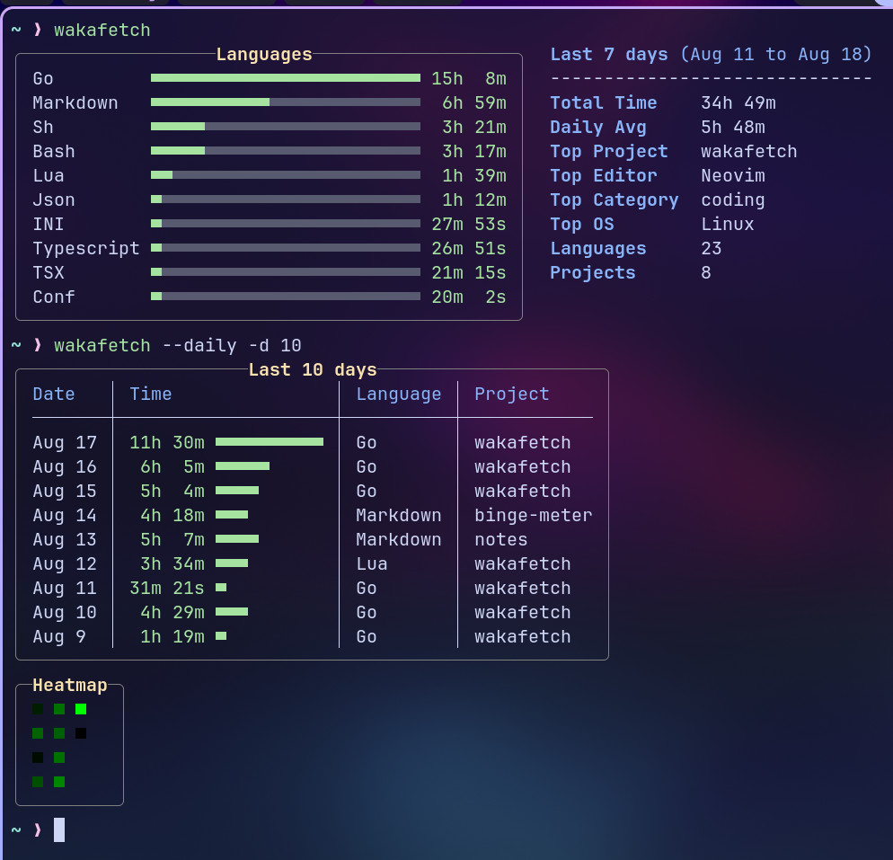
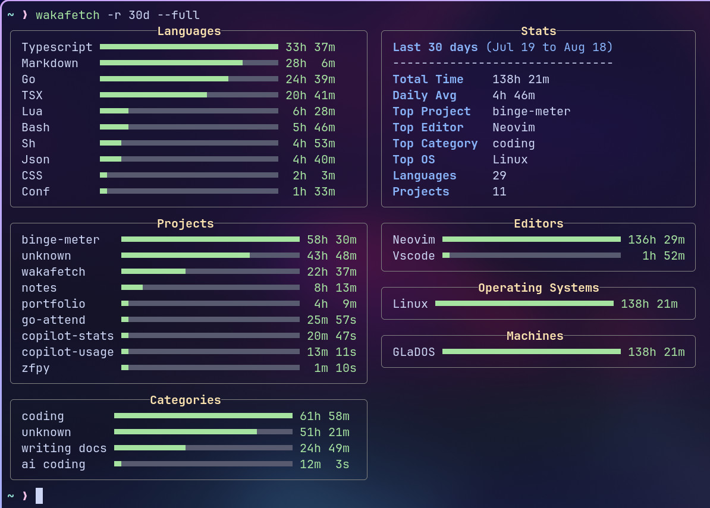
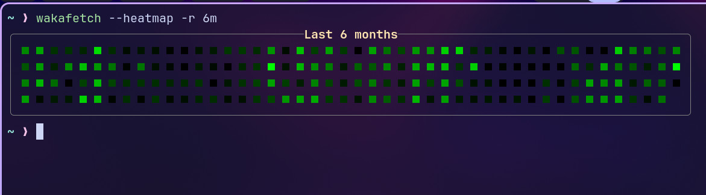

<div align="center">
  <h1>Wakafetch</h1>
  <table>
    <tr>
      <td>
        </td>
      <td>

        
    </td>
    </tr>
  </table>
</div>

A command-line tool to fetch and display your coding stats from WakaTime or Wakapi, right in your terminal.

-----

## ✨ Features
- **Quick Stats**: Get a summary of your coding activity for various time ranges (using `--range` or `--days`)
- **Deep Dive**: Use the `--full` flag to see everything: languages, projects, editors, OSs, and more.
- **Daily Breakdown**: The `--daily` flag gives you a clean table of your day-to-day grind.
- **Activity Heatmap**: Visualize your coding frequency with a GitHub-style heatmap using the `--heatmap` flag.
- **Waka-Agnostic**: Works flawlessly with both the official [WakaTime](https://wakatime.com) API and [Wakapi](https://github.com/muety/wakapi)
- **Zero-Config Friendly**: Automatically reads your API key from the standard `~/.wakatime.cfg` file. You can also override it with a flag

-----

## 🚀 Installation

### With Go (Recommended)

It'll install the binary into your `$GOPATH/bin` or `$GOBIN`
```bash
go install github.com/sahaj-b/wakafetch@latest
```

### From Source

```bash
git clone https://github.com/sahaj-b/wakafetch.git
cd wakafetch
go build
./wakafetch --help
```

-----

## 🔧 Configuration

`wakafetch` looks for a `.wakatime.cfg` file in your home directory (`~/.wakatime.cfg`). Get your API key from your WakaTime/Wakapi settings page.
The config file should look like this:

```ini
[settings]
api_key = your-super-secret-api-key
api_url = https://wakatime.com/api # Optional: for Wakapi: https://wakapi.dev/api, or your self hosted instance URL
```

> [!NOTE]
> This config is already set up if you installed WakaTime extension for your editor.
-----

## 💡 Usage

Just run the command. The default view shows your stats for the last 7 days.
```bash
wakafetch
```

For a full list of commands and options, run with the help flag.
```bash
wakafetch --help
```
```
Usage: wakafetch [options]
Options:
  -r, --range <string>      Range of data to fetch (today/7d/30d/6m/1y/all) (default: 7d)
  -d, --days <int>          Number of days to fetch data for (overrides --range)
  -f, --full                Display full statistics
  -D, --daily               Display daily breakdown
  -H, --heatmap             Display heatmap of daily activity
  -k, --api-key <string>    Your WakaTime/Wakapi API key (overrides config)
  -n, --no-colors           Disable colored output
  -h, --help                Display help information
```

-----

## Examples

Here are a few ways to use it:

**1. Default view (last 7 days)**
```bash
wakafetch
```

**2. See stats for the last 30 days**
```bash
wakafetch --range 30d
```

**3. Get the full, detailed stats for the last year**
```bash
wakafetch -r 1y -f
```

**4. Check your stats for the last 100 days**
```bash
wakafetch --days 100
```

**5. Get a daily breakdown table for the last 2 weeks**
```bash
wakafetch --days 14 --daily
```

**6. Show just the activity heatmap for the last month**
```bash
wakafetch -r 30d -H
```
-----

## 📜 License
This project is licensed under the MIT License.
